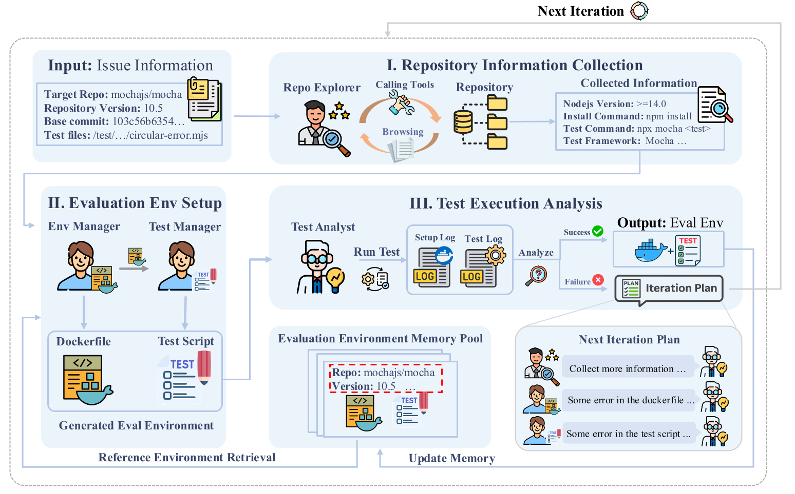

[](https://github.com/Akshay090/svg-banners)


# 👉🏻 SWE-Factory 👈🏻

Your Automated Factory for Issue Resolution Training Data and Evaluation Benchmarks.

## ✨ Key Features

* 


## 📦 Environment Setup

To get started, run the bash script below to set up the environment:

```bash
conda create --name swe-factory python=3.12.5 -y
conda activate swe-factory
pip install -r requirements.txt
```

## 🚀 Run SWE-factory

After setting up the environment, you can get your custom issue benchmark by running the script below:

```bash
export OPENAI_API_BASE_URL=<your url>
export OPENAI_KEY=<your key>
bash run/run.sh
```

## 📃 Technical Report

[arXiv Preprint](http://arxiv.org/abs/2505.04606)

### Overview

As an LLM-driven multi-agent tool, SWE-Factory comprises four agents:



1. **Context Retrieval Agent**  
   - Clones the repository associated with each GitHub Issue to the local machine.  
   - Automatically gathers information required to build the environment and run tests.  
   - Shares collected data with the Dockerfile Generation Agent and the Evaluation Script Generation Agent.

2. **Dockerfile Generation Agent**  
   - Generates a Dockerfile that sets up the environment needed to reproduce and run the Issue’s test suite.  
   - Shares the resulting Dockerfile with the Evaluation Script Generation Agent for further use.

3. **Evaluation Script Generation Agent**  
   - Writes scripts that, once the Dockerfile builds the container, execute the target tests within that environment.  
   - Ensures that all necessary test commands and parameters are included.

4. **Test Analysis Agent**  
   - Launches the evaluation scripts inside the built container.  
   - Determines whether the target tests pass or fail.  
   - If tests succeed, outputs the finalized Dockerfile and evaluation script; otherwise, plans the next iteration of adjustments and signals earlier agents to update their outputs.

### Results

We collected a total of 671 issues from 12 repositories covering four languages (Python, Java, JavaScript, and TypeScript) and evaluated them using three models:  
- **GPT-4.1-mini**  
- **DeepSeek-v3-0324**  
- **Gemini-2.5-flash-preview**  

The evaluation metrics are:  
1. **Fail2Pass Rate**: Following the SWE-bench Fail2Pass validation procedure to determine whether an instance is valid.  
2. **Success Rate**: The percentage of issues for which the model successfully generated a runnable result.  
3. **Cost (USD)**: Average API cost for each issue.  
4. **Time (min)**: Average Time cost for each issue..

The summary of our experimental results (sample numbers—please replace with actual measured values) is shown below:

| Model                    | Fail2Pass Rate (%)     | Success Rate (%)     | Cost (USD) | Time (min) |
|--------------------------|------------------------|----------------------|------------|------------|
| GPT-4.1-mini             | 42.9 (288/671)         | 57.2 (384/671)       | 0.0445     | 22.37      |
| DeepSeek-v3-0324         | 35.9 (241/671)         | 50.8 (341/671)       | 0.0435     | 22.45      |
| Gemini-2.5-flash-preview | 37.0 (248/671)         | 49.8 (334/671)       | 0.0245     | 27.03      |

## 📖 Citation

If you find our scripts useful for your research or applications, feel free to give us a star ⭐ or cite us using:

```bibtex

```
